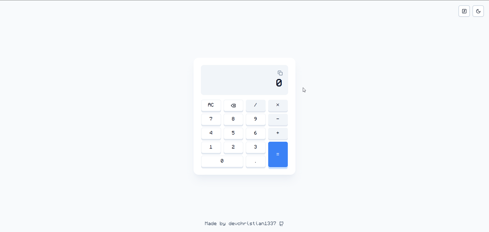

# Calcolatrice

Un moderno e versatile calcolatore costruito con React, TypeScript e Framer Motion. Presenta un'interfaccia pulita con supporto per la modalità scura e funzioni scientifiche avanzate.

## Caratteristiche

- 🧮 Calcoli di base e scientifici con opzioni avanzate
- 🌍 Supporto per la modalità scientifica e semplice
- 🌓 Modalità Chiara/Scura
- 📋 Cronologia delle operazioni con funzionalità di copia
- 💪 Gestione degli errori matematici con messaggi chiari
- ✨ Animazioni fluide con Framer Motion
- 📱 Design responsive
- 🔢 Scorciatoie da tastiera per funzioni scientifiche
- 🔄 Persistenza delle preferenze utente (tema e modalità)

## Stack Tecnologico

- React
- TypeScript
- Vite
- Framer Motion
- Tailwind CSS
- Lucide React (per le icone)